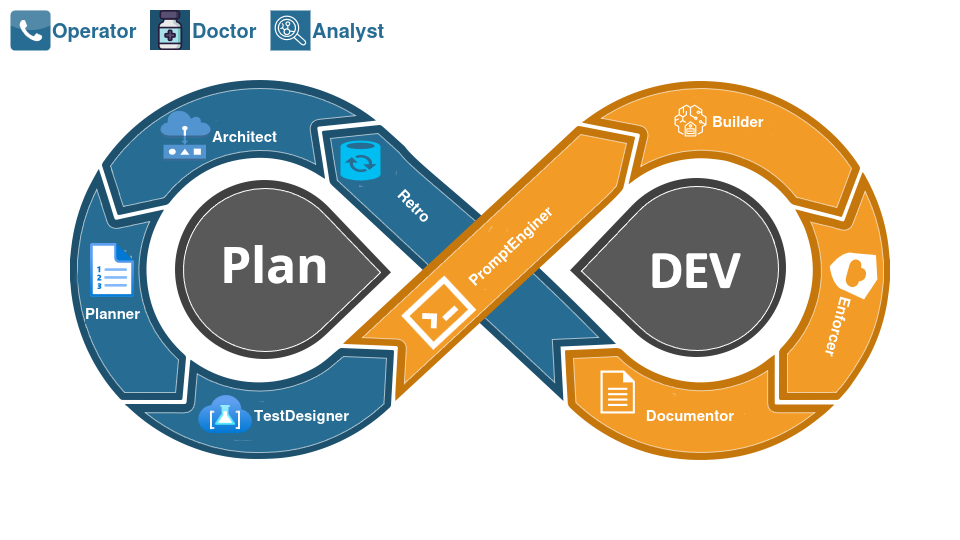

# Q-TguDiilt
## A Self‑Improving AI Software Engineering Workflow Engine

<!-- Placeholder, no logo created yet
<p align="center">
  
</p>
-->

## Overview
A governed, multi‑profile AI workflow engine designed for structured software development.
This repository contains the rule system, workflow mechanics, and documentation that define
how the engine operates, learns, and maintains architectural integrity over time.

> [!IMPORTANT]
> This Workflow engine is built with and for Amazon Q.
> It has not been used, or tested with any other AI systems.
> 
> Q provides several capabilities required for this engine to function:
> 
> - automatic rule context loading from `.amazonq/rules/`
> - multiple isolated chat tabs, allowing simultaneous conversations with different profiles
> - saved prompt support for consistent workflow execution
> - reliable multi‑file reading and writing with workspace awareness
> - fixed cost monthly billing
> 
> These capabilities form the substrate this workflow engine depends on.
> Without them, the system’s guarantees and behavior would not hold.
> 
> Everything in this repository leverages Amazon Q's rule system and prompt mechanics,
> ensuring consistent and reliable behavior for AI‑assisted development.



## What This Repository Contains
- The AI rule system (`.amazonq/rules/`)
- Workflow mechanics and agent behaviors
- Profiles and responsibilities
- Communication standards (commit messages, code diffs, user stories)
- Architecture rules and domain definitions
- Developer documentation (`/docs/dev`)
- User documentation (`/docs/user`)

## How to Navigate This Repository

### Usage Documentation
For a high‑level map of the system, start with the [Overview](docs/overview.md).

### `.amazonq/rules/`
The governed rule system that defines:
- universal architectural rules
- project‑specific extension points
- communication and commit standards
- workflow mechanics
- profile behaviors

Each rule file has a corresponding `*-project.md` extension file for project‑specific overrides.

### `/docs/dev`
Developer‑facing and AI-facing documentation:
- AI workflow system
- Source material the AI reads, scrapes, and distills into focused AI‑ready files
- Full architectural references used by human engineers
- Commit style guide
- Contributing guidelines
- Additional technical references and deep dives

The AI consumes these documents as its governed knowledge substrate.
It extracts only the relevant sections into smaller, purpose‑built AI files,
while the full versions remain available for human review and cross‑reference.

### `/docs/user`
User‑facing documentation (to be expanded as features land).

## Core Concepts
- Governed rule system
- Multi‑profile AI collaboration
- Domain‑driven development
- Drift‑resistant architecture
- Explicit extension points
- Structured commit and communication standards

(Each of these will get its own section as the system evolves.)

## 📦 Installation

Follow these steps to install the Amazon Q prompts, rules, and documentation
into your repository and activate them in your IDE.

### Prerequisite

Ensure Amazon Q is installed, signed in, and configured in your IDE (VS Code, JetBrains, etc.).  
Amazon Q must be active and authenticated before it can load prompts from this repository.

### 1. Copy the required folders into your repository

Place the following directories at the root of your repository:

- `.amazonq/` — prompt files, rules, workflow, and agent configurations
- `docs/` — extended context and reference material

Commit these folders so Amazon Q can index them.

### 2. Open your IDE with Amazon Q enabled

Launch your editor with Amazon Q active.  
Amazon Q will automatically detect the repository boundary and read the files you added.

### 3. Open the Amazon Q chat panel

Open the Amazon Q chat sidebar inside your IDE.

### 4. Install the prompts, rules, and docs into Amazon Q’s active configuration

Type the following message into the Amazon Q chat:

```
Install the saved prompts, from @prompts
into your active Amazon Q prompts directory.
```
*Note*: @prompts should be selected to point to: `.amazonq/prompts`

Amazon Q will copy saved prompts from the repository, to the user's prompt directory.  
*Note:* Amazon Q will need permission to update a folder, `~/.aws/amazonq/prompts`

## Getting Started
Once the prompts, rules, and documentation are installed,
the workflow engine is ready to operate.

  1. Open Amazon Q in your IDE
  2. Start with a safe analytical first task
     ```
     @workspace
     As Architect, analyze my repository and summarize its current structure,
     boundaries, and responsibilities.
     ```
     This provides a deterministic overview of your codebase
     and demonstrates how governed profiles behave. 
  3. Continue in the same chat with a deeper architectural evaluation  
     (The Architect profile is still active from step 2,  
      as long as you remain in the same chat  
      and the profile has not been explicitly changed.)
     ```
     @workspace
     identify structural gaps, missing boundaries, or incomplete features
     based on the current state of the repository. 
     Help me generate a story based on these findings.
     ```
  4. Follow the profile’s guidance, to `@handoff to planner`
 
Refer to `/docs/dev` for deeper architectural context as needed

This section provides the minimal activation steps.  
All deeper explanations, examples, and workflow patterns live in the documentation.

---

## Features
This workflow engine provides a governed,
multi‑profile AI development environment designed for structured,
drift‑resistant software engineering.

### **Deterministic Multi‑Profile Workflow Engine**
The system executes work in a governed sequence of profile‑scoped steps.
Each profile has isolated responsibilities, explicit handoff mechanics,  
and rule‑enforced behavior, ensuring predictable,
repeatable workflow execution with no cross‑profile drift.

### **Self‑Improving Workflow System**
The engine improves itself through governed retrospectives.
Retrospective identifies drift or inefficiency, lists recommendations,
and once the user selects one, starts a side trip workflow to apply updates to 
rules and/or documentation. Improving the system for future cycles,
evolving it without losing architectural integrity.

### **Domain‑Agnostic Workflow Framework**
Although this repository ships with software‑engineering profiles,
the underlying workflow engine is domain‑agnostic.
By defining new profiles, this system can be adapted to other domains
such as business analysis, data science, operations, research workflows,
or any governed multi‑step process.

### **Governed Rule System**
A universal rule layer that enforces architectural boundaries,
communication standards, and deterministic behavior across all AI profiles.

### **Multi‑Profile Collaboration**
Specialized profiles (Architect, Planner, Analyst, Developer, Reviewer, etc.)  
operate with isolated responsibilities, context windows, and explicit handoff mechanics.

### **Workspace‑Aware Reasoning**
Profiles operate on real project context and use Amazon Q's `@workspace` command,
enabling accurate analysis, planning, and code generation grounded in the repository.

### **Structured Development Loop**
A repeatable, governed workflow:
- **Analyze** - *Architect/Analyst* evaluate Boundaries Structure, and gaps
- **Plan** - *Planner* writes stories
- **Create Test Criteria** - *TestDesigner* writes Acceptance Criteria 
- **Implement** - *Builder* writes tests and code
- **Review** - *Enforcer* validates code meets standards and that tests pass 
- **Commit** - *Documentor* updates documentation, and writes commit message
- **Retrospective** - *Retrospective* analyzes the workflow cycle and recommends improvements

Each step is profile‑scoped and rule‑constrained.

### **Drift‑Resistant Architecture**
The engine maintains consistency over time through:
- **Explicit user review of `@handoff` at every step, preventing drift before it happens.**
- explicit extension points
- project‑specific overrides
- deterministic profile behavior
- rule‑enforced communication patterns
- links changes to existing patterns
- updates documentation as patterns change

#### Retrospective
The Retrospective Process detects when drift has happened since the last retrospective,
and will suggest ways to reduce or eliminate that kind of drift in future cycles,  
usually via documentation or rule updates.

### **AI‑Ready Documentation Pipeline**
The system distills `/docs/dev` into focused, profile‑specific AI files,  
ensuring the AI operates on curated, relevant context rather than raw documents.

### **Commit and Communication Standards**
Built‑in conventions for:
- commit messages
- diffs
- user stories
- architectural notes
- handoff messages

Ensuring clarity and traceability across all AI‑assisted work.

## Roadmap
The roadmap is a living planning artifact, maintained in GitHub Projects
and shared across all repositories in this ecosystem.
It reflects current priorities, active workstreams, and long‑term architectural direction.

The AI reads the roadmap as part of its governed planning substrate.
It extracts relevant items into focused AI‑ready files,
while the full project remains the canonical source of truth.

**View the full roadmap:**  
📋 [GitHub Project Tracker](https://github.com/raystorm?tab=projects) TODO: make project public

## Contributing
See [`/docs/dev/CONTRIBUTING.md`](docs/dev/CONTRIBUTING.md) for contribution guidelines.
