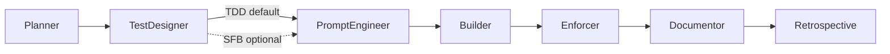
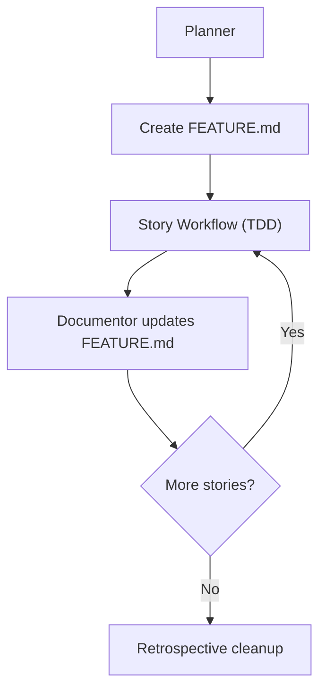
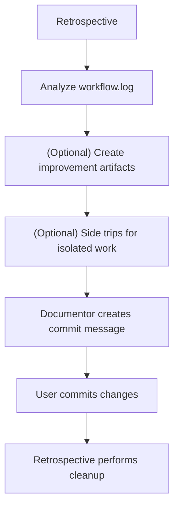
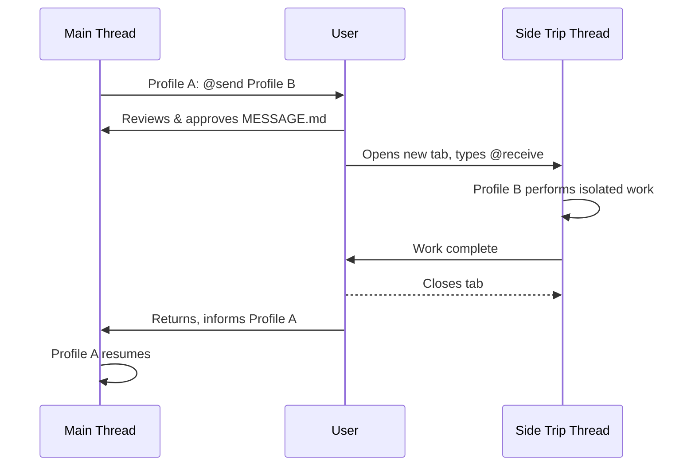
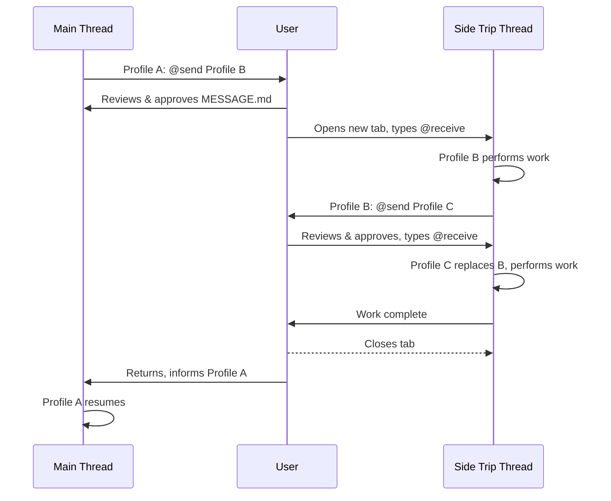
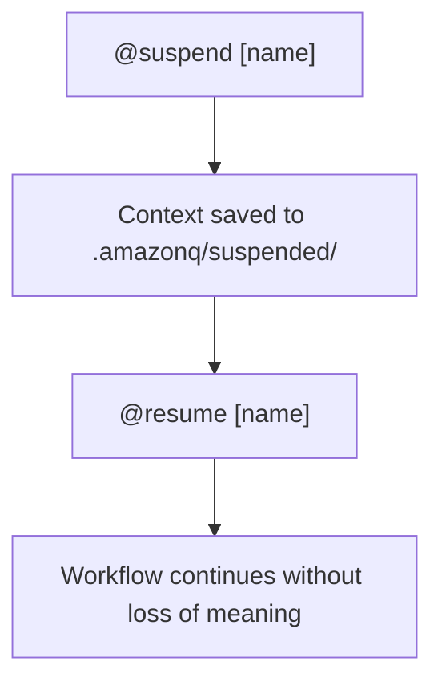

# Workflow Patterns

Execution Shapes of the AI Workflow System

> [!TIP]
> *Notation:* Horizontal arrows (→) represent single‑thread sequential flow.  
> Vertical arrows (↓) represent thread or context (profile) transitions.

---

## Purpose

Workflow patterns define the **execution shapes** the system can run.  
They describe *how profiles move through a workflow*, not:
* mechanics ([handoffs](glossary.md#handoff), confirmation, logging)
* contract invariants
* profile responsibilities

Patterns are **recipes** for sequencing profiles.  
Mechanics define *how* transitions work.  
The Contract defines *what must always be true*.  
Profiles define *who does what*.

This file defines the **canonical workflow shapes supported today**.

Workflows and patterns end implicitly when the user begins a new task.
There is no explicit ‘end’ command or termination event.

---

## Default Pattern: Test‑Driven Development (TDD)

TDD is the **default workflow pattern**.  
Unless explicitly overridden, all stories run in TDD mode.

TDD ensures:
* requirements are testable
* behavior is defined before implementation
* Builder implements tests + feature together
* Enforcer validates test coverage and correctness
* Documentor captures both test and implementation context

### When to Use

Always, unless:
* the domain is exploratory
* the API is unknown
* the story is too ambiguous for test design
* the user explicitly requests Normal mode

### Profile Sequence

```text
Planner → TestDesigner → PromptEngineer → Builder → Enforcer → Documentor → Retrospective
```



*Solid line = TDD (default). Dashed line = Straight‑Forward Build (override).*

### Key Characteristics

* TestDesigner defines test scenarios (Gherkin‑compatible)
* PromptEngineer incorporates test scenarios into the Builder prompt
* Builder implements tests and feature in one loop
* Enforcer validates test coverage and alignment
* Documentor documents both tests and implementation
* Retrospective analyzes workflow.log for improvement

---

## Straight‑Forward Build Workflow (Override Mode)

Straight‑Forward Build is the **explicit override**.  
Planner, or TestDesigner must choose it intentionally.

This pattern is used when:
* the work is exploratory
* the domain is unstable
* test scenarios cannot be defined upfront
* the user requests a non‑TDD flow
* the tests already cover the change, and no updates are necessary

### Profile Sequence

```text
Planner → TestDesigner(optional) → PromptEngineer → Builder → Enforcer → Documentor → Retrospective
```

### Key Differences from TDD

* TestDesigner is Optional
* PromptEngineer produces a simpler Builder prompt
* Builder implements feature + tests together without TDD sequencing
* Enforcer validates correctness but not TDD ordering
* Documentor documents implementation and tests as a single unit

Straight‑Forward Build is a **fallback**, not a default.

---

## Behavior‑Driven Development (BDD)

BDD is an **escalation** of TDD that adds stakeholder‑readable
scenarios and living documentation on top of the standard TDD workflow.

TDD → BDD → HDD (Hypothesis‑Driven Development) represents
a progression of rigor. BDD is supported today. HDD requires
additional profiles and integrated project planning
(roadmap/backlog tooling).

### When to Use

* Story requires stakeholder collaboration on acceptance criteria
* Living documentation is valuable for the feature
* Executable specifications would benefit the team
* User explicitly requests BDD approach

### Profile Sequence

Same as TDD:
```text
Planner → TestDesigner → PromptEngineer → Builder → Enforcer → Documentor → Retrospective
```

### Key Differences from Standard TDD

* Planner notes “BDD approach” in story
* TestDesigner writes scenarios with stakeholder collaboration
  in mind (Given/When/Then with domain language)
* Scenarios serve as living documentation beyond test validation
* No mechanical difference in workflow execution

---

## Multi‑Story Feature Workflow

Used when a feature requires multiple sequential stories.

### When to Use

* Feature spans multiple related changes
* Stories must be executed in order
* Context must persist across stories

### Artifacts

* `.amazonq/work/FEATURE.md` (created by Planner)
* Updated by Documentor between stories
* Cleaned up by Retrospective after feature completion

### Execution Shape



### Key Characteristics

* Planner defines story list and marks Story 1 “In Progress”
* Documentor marks each story complete and advances the pointer
* Retrospective performs feature‑level analysis

---

## Retrospective Workflow

Retrospective is the **improvement loop**.  
It analyzes workflow.log, identifies patterns, and produces Keep/Stop/Start recommendations.  
Retrospective may generate improvement artifacts that require other profiles to apply changes.

### When to Use

* After any story
* After any feature
* When the user wants workflow improvements

### Execution Shape



### Key Characteristics

* Reads `.amazonq/workflow.log`
* Identifies blockers, drift, and improvement opportunities
* May create rule or prompt updates as artifacts
* Uses side trips for isolated work (PromptEngineer, Architect, etc.)
* **Retrospective does not commit changes itself**
* Cleans up FEATURE.md and work directory when appropriate

---

## Side Trip Workflow Pattern

Side trips are **parallel, isolated work** performed by another profile.  
They allow the current workflow to remain active while another profile performs work in a separate thread.

Side trips can be initiated in two ways:
1. **Profile‑initiated** — via `@send [Profile]`
2. **User‑initiated** — by opening a new chat tab and activating a profile directly

### Thread

A Thread is an isolated workflow execution context,
represented by a single chat instance, with its own workflowId and state.

### Thread Labels

Side trips use two threads:
* **[Main Thread](glossary.md#main-thread)** — the tab hosting the active Cycle
* **Side Trip Thread** — the tab created after the first `@send`

All chained side trip work happens in the **same Side Trip Thread**.  
Profiles may replace each other inside this thread,
but no additional threads are created, or supported.

### Profile‑Initiated Side Trip (send/receive)



**Characteristics**
* Uses `MESSAGE.md`
* Does not mutate main workflow state
* Original profile remains active

### User‑Initiated Side Trip (fresh chat)

User opens a new tab, activates a profile directly
(e.g., `Act as [Profile]` or `@dr`), performs isolated work,
closes the tab, and returns to the main thread.

**Notes**
* `@dr` is a convenience command to start the doctor profile,  
  and troubleshoot a failing test. It is optional.
* This is the correct pattern for exploratory, diagnostic, or inspection work

### Multi‑Step Side Trips (Chained Send/Receive)

Side trips may involve multiple steps.  
A profile performing isolated work can initiate additional side trips
before returning to the main workflow.  
Only the **first** step opens a new tab.  
Subsequent steps occur in the **same Side Trip Thread**,
and each `@receive` replaces the active profile.

#### Execution Shape



#### Key Characteristics

* Only the first `@send` performed in the Main Thread
* Opening a new tab is a user action
* Subsequent `@send`/`@receive` calls occur in the same Side Trip Thread
* Each `@receive` **replaces** the active profile
* **Control never returns to B**
* The chain ends when all side trip work is complete.
* The main workflow remains suspended until the chain completes
* If Profile A was waiting on the side trip,
  the user must inform Profile A of side trip completion to continue  

---

## Recovery Workflow (Suspend/Resume + Auto‑Suspend)

[Suspend/Resume](glossary.md#suspendresume-semantics) is the **context preservation pattern**.  
Auto‑Suspend provides lightweight recovery checkpoints.

### When to Use

* Pausing work to handle unrelated tasks
* Switching to another workflow
* Recovering from accidental tab closure

### Execution Shape



### Key Characteristics

* Suspended contexts follow canonical shape
* Auto‑suspend updates on stable events
* Resume restores profile, goal, and state

---

## Pattern Comparison Table

| Pattern                    | Default? | Key Profiles                                                          | Artifacts                                           | Notes                                  |
|----------------------------|----------|-----------------------------------------------------------------------|-----------------------------------------------------|----------------------------------------|
| **TDD Workflow**           | Yes      | Planner → TestDesigner → PE → Builder → Enforcer → Documentor → Retro | Test scenarios, Builder prompt, diffs, workflow.log | Safest, most stable pattern            |
| **Straight‑Forward Build** | No       | Planner → PE → Builder → Enforcer → Documentor → Retro                | Builder prompt, diffs, workflow.log                 | Used for exploratory or ambiguous work |
| **Multi‑Story Feature**    | N/A      | Planner, Documentor, Retro                                            | FEATURE.md                                          | Tracks sequential stories              |
| **Retrospective**          | N/A      | Retrospective (+ optional side trips)                                 | workflow.log, improvement artifacts                 | Improvement loop                       |
| **Side Trip**              | N/A      | Any → Any                                                             | MESSAGE.md (profile‑initiated)                      | Parallel isolated work                 |
| **Suspend/Resume**         | N/A      | Any                                                                   | Suspended context files                             | Context preservation                   |

---

## Summary

These patterns define the **execution shapes** of the AI Workflow System as it exists today.  
They do not redefine mechanics, contract invariants, or profile rules.  
They show how profiles collaborate through explicit,
reviewable transitions to produce predictable, stable, and self‑improving workflows.
