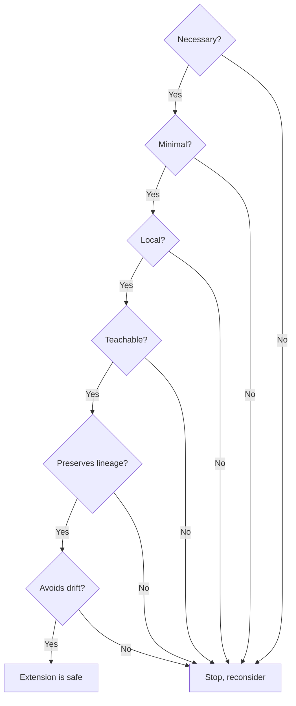

# 8. Extending the System

*How to safely add profiles, rules, workflows patterns, 
or capabilities without breaking the architecture.*

The workflow engine is intentionally minimal.  
It exposes a small, well‑defined extension surface.  
Everything else is governed by the [Contract](dev/contract.md),
the [Rules & Governance](dev/governance.md) model, 
and the [Profile](profiles.md) model.

Extending the system means adding new behavior ***without* introducing drift**,  
***without* violating invariants**, and ***without* collapsing identity or lineage**.

This chapter defines the safe extension points, the boundaries around them,  
and the principles that keep the system stable as it grows.

---

## 1. Extension Philosophy

Extensions must be:
* **Quiet** — minimal, clear, and free of ceremony
* **Governed** — aligned with Contract invariants and rule precedence
* **[Teachable](glossary.md#teachable-artifact)** — intention‑revealing, predictable, and easy to audit
* **Local** — changes should not ripple across unrelated rules
* **Lineage‑preserving** — universal → project override

The system grows through **explicit additions**, *not* implicit mutations.

Extensions should feel like adding a new tool to a well‑organized workshop,  
not like rearranging the workshop to fit the tool.

---

## 2. What Can Be Extended

The system supports extension in five areas:
1. **Profiles**
2. **Rules** (universal or project‑level)
3. **Workflow Patterns**
4. **Capabilities** (mechanics, validation layers, behaviors)
5. **Saved Commands**

Each has a defined extension surface and a set of boundaries.

---

## 3. Extending Profiles

Profiles are the governed actors of the system.  
They are the safest and most expressive extension point.

A new profile is appropriate when:
* a new responsibility emerges
* a domain needs its own worldview
* a behavior should be isolated to prevent drift
* a workflow step becomes overloaded

### 3.1 Profile Structure

A profile consists of:
* a **name**
* a **worldview** (what it notices and cares about)
* a **responsibility** (single purpose)
* a **rule file** (optional, only if governance is needed)
* a **Uses:** declaration in `_PROFILES.md`

Profiles begin conceptual.  
Governance is added only when needed.

### 3.2 Adding a New Profile

To add a profile:
1. **Create a name**
   Choose a clear, intention‑revealing identity that reflects a single responsibility.
2. **Define responsibilities and boundaries**  
   Keep them minimal and intention‑revealing.
3. **Add a `Uses:` entry in `_PROFILES.md`**  
   Include only the rule files the profile needs.
4. **Avoid over‑governing**  
   Start with shared rules (`foundation/*`, `workflow/*`).  
   Add profile‑specific rules only when required.
5. ***(Optional)* Create a rule file** 
   Rule files are only created when governance or explicit boundaries are needed.
   Example: `.workflow/rules/profiles/new-profile.md`
6. **Preserve identity**  
   A profile must not overlap with existing profiles.  
   If it does, refine responsibilities instead of adding a new actor.

### 3.3 Extending an Existing Profile

Extend a profile only when:
* its domain has grown
* its responsibilities need clarification
* its boundaries need reinforcement

Additions should be:
* local
* minimal
* explicit
* documented in the profile’s rule file

Never modify a profile to perform another profiles duties.  
Updates must strengthen clarity, identity, or outputs of the existing profile.  
Profiles may evolve and gain responsibilities,
but only when those changes are consistent with the profile's core identity.

---

## 4. Extending Rules

Rules define the behavior of the system.  
They follow a strict lineage:

```text
Contract → Universal Rule → Project Override
```

### 4.1 Universal Rules

Universal rules live in: `.workflow/rules/<category>/*.md`

They define baseline behavior for all projects.

Add a universal rule when:
* a behavior is common across all projects
* a new invariant is needed
* a new category of rules emerges

Universal rules must be:
* minimal
* stable
* domain‑agnostic
* aligned with the Contract

### 4.1a Activation Layer (Not an Extension Point)

The Activation Layer (`.amazonq/rules/`) is **not** an extension point.

It contains only system bootstrap rules:
* correctness guarantees
* profile activation triggers

These rules are loaded by Amazon Q's native rule system in every chat.
They are minimal, stable, and must not be extended by projects.

To add new governance, use the Governance Layer (`.workflow/rules/`).

### 4.2 Project‑Level Overrides

Project overrides live in: `*-project.md`

They refine or supersede universal rules.

Overrides must:
* use the explicit marker `Override:`
* be local to the project
* be intention‑revealing
* override only what they reference

Example from `general-project.md`:

> “This file is intentionally empty.”
>
> Project rules are added only when needed.

This is the correct default.

### 4.3 Note on `.workflow/rules/tech/`

The `tech/` category is a special case.
It contains both:
* universal technical rules (e.g., formatting.md)
* project‑specific technical rules, added by the project as needed

Projects may add their own tech rule files to: `.workflow/rules/tech/*.md`

These rules are not universal.  
They apply only to the project and do not require the `Override:` marker.

### 4.4 Adding a New Rule File

Add a new rule file only when:
* no existing rule file fits
* the rule is stable and reusable

Check existing rule files before creating new ones.

> [!TIP]
> The `tech` category applies to universal and project rules. 
> Adding new rules files to other categories may require updating `_PROFILES.md` 

---

## 5. Extending Workflow Patterns

Workflow patterns define execution shapes.  
They do not define mechanics or invariants.

Add a new pattern when:
* a new execution shape emerges
* a domain requires a repeatable sequence
* the pattern is stable and teachable

A pattern must define:
* when it is used
* the profile sequence
* the artifacts it touches
* how it interacts with existing patterns

Patterns must not:
* redefine mechanics
* bypass confirmation
* violate Contract invariants
* collapse profile boundaries

Patterns are recipes, not rules.

---

## 6. Meta Loop Invariant

All workflows in the system must implement the same three‑loop [meta loop](glossary.md#meta-loop):

**Plan → Implement → Improve**

This is the stability invariant that makes a [full workflow loop](glossary.md#full-workflow-loop).  
It ensures every workflow is intention‑revealing, deterministic, and self‑improving.

> **Mnemonic:**
> The meta loop can also be expressed as **Plan → Productionalize → Perfect**
> to highlight the parallelism and interconnectedness of the three loops.  
> This is a teaching shorthand, and memory device.
> The canonical loop names remain **Plan, Implement,** and **Improve.**

### 6.1 Purpose

The meta loop provides:
  * a universal execution shape
  * predictable behavior across domains
  * a stable place to anchor new workflows
  * a built‑in correction mechanism
  * drift‑resistant growth

A workflow that does not implement this meta loop is not considered a full workflow loop.

[Short loops](glossary.md#short-loop) are governed, but they are not full workflow loops.

### 6.2 The Three Loops

**Plan** — define the next step, constraints, and success conditions.  
This is the entry point for every full workflow.

**Implement** — *productionalize* — perform the step and produce the artifact.  
This is the *execution* body of the workflow.

**Improve** — *perfect* — evaluate the result, correct course, and feed the next cycle.  
This is the stability mechanism.  
Today this phase is embodied by the *Retrospective* profile,  
but conceptually it is an entire *Improve loop*.

### 6.3 Requirements for New Full Workflows

A full workflow must identify its **Plan**, **Implement**, and **Improve** loops.  
These loops may reuse existing domain loops (e.g., Dev, Ops, Strategy, Sec)  
or combine them when appropriate.

A new full workflow must document:
  * which profile(s) perform **Plan**
  * which profile(s) perform **Implement** 
  * which profile(s) perform **Improve**

This mapping must be intention‑revealing, stable, and documented. 
The loops do not need to be newly created — they only need to be explicit.
  
A workflow that cannot express its Plan, Implement, and Improve loops  
is not stable enough to be added as a full workflow loop.

### 6.4 Boundaries

The meta loop itself — **Plan → Implement → Improve** — is constant.  
Its phases, order, and purpose must not be redefined.

However, extensions may:
  * add new Plan loops (e.g., Ops planning, Sec planning)
  * add new Implement loops (e.g., deployment, operations, security)
  * add new Improve loops (e.g., operational retrospectives)
  * compose loops into broader domains (DevOps, DevSecOps, etc.)

Extensions must fit **within** the meta loop,  
but they may expand or refine any phase as the system grows.

The meta loop is the governing shape of the system.
Its **content** is extensible. Its **core structure** is not.

---

## 7. Extending Capabilities

Capabilities are system behaviors that are not tied to a single profile:
* logging
* auto‑suspend
* confirmation
* git management
* testing
* AWS commands
* validation layers

Capabilities live in `workflow/`, `foundation/`, `tech/`, or `architecture/`.

Add a capability when:
* a new invariant is needed
* a new mechanic is required
* a new validation layer improves stability

Capabilities must:
* be minimal
* be composable
* not break existing workflows
* not require profile improvisation

Capabilities must not:
* redefine Contract semantics
* alter command behavior
* change artifact shapes

---

## 8. Extending Saved Commands

Commands are the only workflow actions a user can issue.  
They create artifacts, activate profiles, or manage state.

Add a new command only when:
* a new workflow action is needed
* the action cannot be expressed through existing commands
* the action has a clear, stable semantic

A new command must:
* have a single responsibility
* create or load a well‑defined artifact
* follow confirmation rules
* be documented in `user-commands.md`
* be implemented as a saved prompt in `.amazonq/prompts/`

Commands must not:
* bypass confirmation
* auto‑activate profiles
* mutate workflow state implicitly
* overlap with existing commands

---

## 9. Extension Boundaries

Extensions must not violate:

### 9.1 Contract Invariants

* artifact shapes
* command semantics
* cross‑profile invariants
* nullability rules

### 9.2 Workflow Mechanics

* [handoff](glossary.md#handoff) semantics
* [side‑trip](glossary.md#side-trip) semantics
* [confirmation rules](../.workflow/rules/workflow/workflow-mechanics.md#changeover-confirmation)
* [logging rules](../.workflow/rules/workflow/logging.md)
* [suspend/resume](glossary.md#suspendresume-semantics) behavior

### 9.3 Profile Stability

* no auto‑switching
* no blended roles
* no cross‑profile improvisation or work

### 9.4 Governance Model

* override marker
* rule precedence
* lineage preservation

These boundaries define the system itself.

---

## 10. Extension Checklist

Before adding anything, ask:

### 1. Is this extension necessary?

Or can an existing profile or rule handle it?

### 2. Is it minimal?

Or is it adding ceremony or unnecessary complexity?

### 3. Is it local?

Or will it ripple across unrelated rules?

### 4. Is it teachable?

Would a new contributor quickly and easily understand why it exists?

### 5. Does it preserve lineage?

Is the override explicit?  
Is the rule placed in the correct file?

### 6. Does it avoid drift?

Does it reinforce boundaries, not blur them?

If the answer to all of these questions is “yes,” the extension is safe.



---

## 11. Summary

Extending the system is not about adding complexity.  
It is about adding *clarity*.

The architecture grows through:
* new profiles
* new rules
* new patterns
* new capabilities
* new commands

Each addition is **explicit**, **minimal**, and **governed**.

The system remains stable because:
* the Contract defines the domain
* universal rules define the baseline
* project overrides refine behavior
* profiles implement rules deterministically
* patterns define execution shapes
* commands define workflow actions

**Extensions fit into this structure.  
They do not reshape it.**
