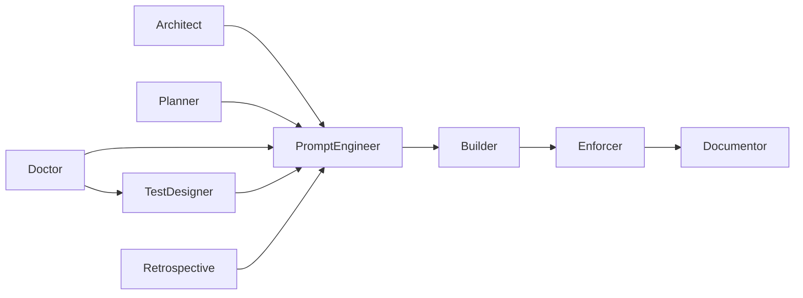
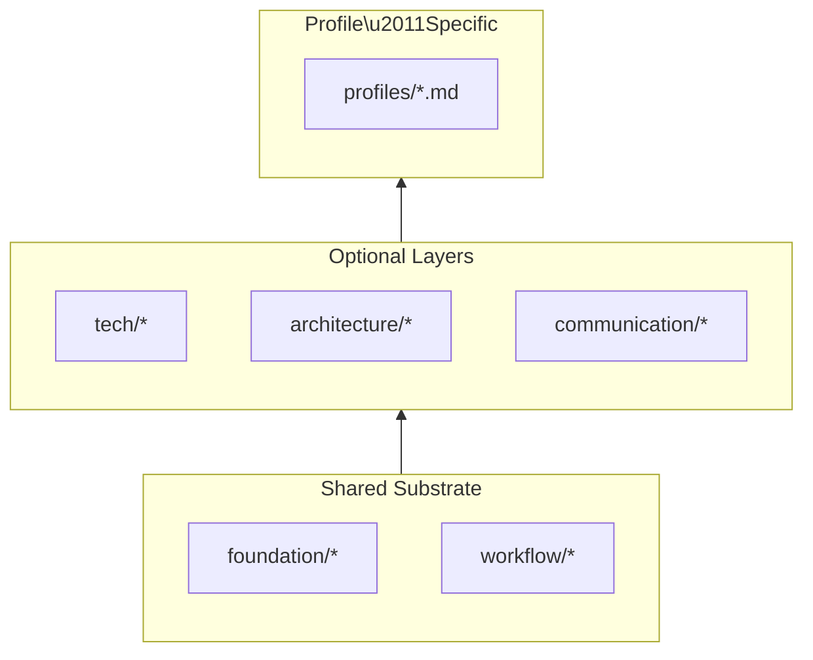

# Profiles

Profiles are the governed actors of the workflow engine.  
Each profile represents a **single responsibility**, a **bounded domain**,
and a **deterministic behavior** defined entirely by rule files.  
Profiles do not improvise or work outside their domain.  
Profiles only store state through explicit workflow processes.  
They execute work, hand off artifacts, and maintain continuity across multi‑step workflows.

Profiles sit between the **Contract** (what is true)
and the **Workflow Patterns** (how work flows).

- **Contract:** domain definition and invariants
- **Profiles:** who acts within those invariants
- **Workflow Patterns:** how those actors move work through the system

For the canonical list of profiles and their rule sources, see:  
[`_PROFILES.md`](../.workflow/rules/_PROFILES.md)

---

## 1. Purpose of Profiles

Profiles exist to:

- enforce **separation of concerns**
- keep behavior **predictable and deterministic**
- maintain **auditability and lineage**
- prevent role drift and overloading
- enable **multi‑agent collaboration** without chaos
- make the system **[teachable](glossary.md#teachable-artifact)** and **governed**

> [!IMPORTANT]
> A profile is not a [persona](glossary.md#persona).  
> It is a **role with rules**, not a personality with preferences.

---

## 2. How Profiles Work

Every profile:

- Loads **universal rules** (foundation, workflow invariants)
- Loads **project rules** (architecture, tech stack, naming, domain)
- Loads **profile‑specific rules** (behavior, boundaries, escalation) (if specified)
- Executes tasks strictly within its domain
- Reinterprets out of domain but in worldview work,
  into known responsibilities, and complete with standard mechanics
- Produces artifacts in the required format
- uses a [changeover](glossary.md#changeover) to send work to the next profile in the workflow

Profiles form a **governed assembly line**.  
Each actor performs one job, performs it well, and yields control.

---

## 3. Profile List

Below is a high‑level summary of each profile’s domain.  
For full behavioral rules, see: 
[`../.workflow/rules/_PROFILES.md`](../.workflow/rules/_PROFILES.md)

### Operator

The primary entry point for user questions. **When in doubt, *call Operator*.**
Routes tasks to the correct profile. Does not perform work.  
**Aliases:** Router, Conductor, Switchboard  
→ [`operator.md`](../.workflow/rules/profiles/operator.md)

### Builder

Implements features, writes code, follows formatting and architecture rules.  
→ [`builder.md`](../.workflow/rules/profiles/builder.md)

### Enforcer

Validates code, formatting, tests, and architectural alignment.  
**Aliases:** Verifier, Validator, 🔫  
→ [`enforcer.md`](../.workflow/rules/profiles/enforcer.md)

### TestDesigner

Identifies test scenarios, edge cases, and validation strategies.  
**Aliases:** TD, Provoker, Hunter  
→ [`test-designer.md`](../.workflow/rules/profiles/test-designer.md)

### Documentor

Writes documentation, commit messages, and story descriptions.  
**Aliases:** commit, keeper, ledger, Engraver  
→ [`documentor.md`](../.workflow/rules/profiles/documentor.md)

### Planner

Creates user stories, backlog items, and manages macro‑level flow.  
**Aliases:** PO, ProductOwner, Strategist  
→ [`planner.md`](../.workflow/rules/profiles/planner.md)

### Tactician

Determines workflow execution strategy, and validates technical story ordering.  
**Aliases:** Tactical, Sequencer  
→ [`tactician.md`](../.workflow/rules/profiles/tactician.md)

### Architect

Defines system design, domain models, and long‑term structure.  
→ [`architect.md`](../.workflow/rules/profiles/architect.md)

### Analyst

Reads code, explains behavior, traces logic, and ambiguity resolution.  
**Aliases:** Analyzer, Auditor, 🔍, 🔎  
<!-- Conceptual, placeholder for if goverened → [`analyst.md`](../.workflow/rules/profiles/analyst.md) -->

### Communicator

Writes release notes, announcements, and public‑facing documentation.  
<!-- Conceptual, placeholder for if goverened → [`communicator.md`](../.workflow/rules/profiles/communicator.md) -->

### PromptEngineer

Writes prompts and governs AI‑facing instructions.  
**Aliases:** PE, Prompter  
→ [`prompt-engineer.md`](../.workflow/rules/profiles/prompt-engineer.md)

### Doctor

Diagnoses failures, applies minimal safe fixes, and escalates when needed.  
**Aliases:** Dr, DR, Medic, 🩺  
→ [`doctor.md`](../.workflow/rules/profiles/doctor.md)

### Retrospective

Analyzes completed workflows, identifies improvements, and highlights successes.  
**Aliases:** Retro, Iterator, 🔄  
→ [`retrospective.md`](../.workflow/rules/profiles/retrospective.md)

### UserExperience

Defines user flows, interaction patterns, and accessibility requirements.  
**Aliases:** UX, UI  
→ [`user-experience.md`](../.workflow/rules/profiles/user-experience.md)

---

## 4. Profile Worldviews

Each profile has an **area of responsibility** —
a worldview that defines what it cares about, what it notices, and what it considers important.
This worldview determines what the profile will act on and what it will ignore.

Some profiles also have **explicit boundaries**, **invariants**, or **escalation rules**,
but these only exist when the profile has a need for them,
and will be implemented in a rule file.

---

## 5 Profile Categories

Profile categories exist for human understanding only.
The system itself does not treat “Conceptual” and “Governed” as functional states.

Profiles are classified based on if they have a profile-specific
`.workflow/rules/profiles/{profileName}.md` rule file.

Profiles fall into two categories:

### A. Conceptual Profiles

These define identity and responsibility but do not require profile-specific configuration.  
They consume shared rules files, but they do not have a profile-specific
(.workflow/rules/profiles/{profileName}.md) rule file,
and they simply ignore work outside their worldview.

**Mental model:** A role with a perspective.

### B. Governed Profiles

These have a profile-specific (.workflow/rules/profiles/{profileName}.md) rule file
that defines:
- domain of authority
- invariants
- boundaries
- escalation paths (if needed)
- required outputs (if needed)

This model keeps the system flexible, minimal, and [drift‑resistant](glossary.md#driftresistant-reasoning):  
profiles only gain profile-specific rules when they need it.

**Mental model:** A role with obligations and constraints.

### 5.1 Operational Differences (Single Table)

This table consolidates all behavioral distinctions into one view:

| Behavior                         | Conceptual Profile                | Governed Profile                      |
|----------------------------------|-----------------------------------|---------------------------------------|
| Has a profile-specific rule file | No                                | Yes                                   |
| Has rule files                   | Yes                               | Yes                                   |
| Enforces invariants              | Yes                               | Yes                                   |
| Stops on boundary                | Yes                               | Yes                                   |
| Changeover                       | Yes                               | Yes                                   |
| Escalates                        | No                                | Only if defined                       |
| Produces required outputs        | No profile-speficic outputs       | Yes                                   |
| Ignores out‑of‑domain work       | Yes (does domain work + responds) | No (documents + escalates if defined) |

“This table gives users a quick, operational understanding of what to expect.”

### 5.2 How Users Know Which One They’re Dealing With

A profile is **conceptual** when:
- it has no profile-specific rule file
- it exists to define identity, worldview, or responsibility
- it is used for routing, framing, or perspective

A profile is **governed** when:
- it has a rule file
- it must enforce boundaries
- it participates in escalation
- it has required outputs or invariants

**Rule of thumb:**  
If a profile has specific obligations, it’s governed.  
If it only has a worldview, it’s conceptual.

---

## 6. Escalation

Not all profiles have defined escalation paths.  
Only governed profiles with rule files may support escalation.

If a profile that supports escalation encounters work outside its domain,  
it must:

1. Stop
2. Document the boundary
3. Escalate to the correct profile
4. Produce a minimal artifact if required

Other profiles simply do not perform work outside their domain or worldview.

---

## 7. Changeovers

Changeovers are explicit and file‑based.  
**Every profile transition to another profile occurs via *Changeover***
They preserve:
- context
- intent
- artifacts
- execution state
- audit trail

Workflow Patterns define the exact sequencing, but common flows include:
- PromptEngineer → Builder → Enforcer
- Enforcer → Documentor 
- Architect → PromptEngineer → Builder
- Planner → PromptEngineer
- Doctor → PromptEngineer or TestDesigner
- Retrospective → PromptEngineer



---

## 8. Rule Loading Model

Profiles do not inherently contain logic. A profile begins as a named identity with a
worldview and an area of responsibility. Explicit governance is added only when needed.

All profiles inherit the shared workflow substrate. This includes the mechanics
that make the system function as a whole: [handoffs](glossary.md#handoff), [side trips](glossary.md#side-trip), logging,
suspend/resume, and other workflow rules. These shared behaviors come from the
universal rule files in `foundation/` and `workflow/`.

Not all profiles have profile‑specific rule files. Some remain conceptual and
operate only with the shared workflow rules. Others, such as Retrospective, have
rich profile‑specific rule files that define menus, flows, or specialized behaviors.

Each profile’s rule loading is defined in the profile index:
[`_PROFILES.md`](../.workflow/rules/_PROFILES.md)

A governed profile might declare:

```markdown
**Uses:**
  foundation/*
  workflow/logging.md
  workflow/auto-suspend.md
  profiles/retrospective.md
```

A conceptual profile might declare only the shared layers,
with no profile‑specific rules at all.

The key idea is that **Uses** determines which rule files shape a profile’s
behavior. This keeps the system explicit, minimal, and drift‑resistant,
while allowing each profile to be as simple or as expressive as it needs to be.



*Each profile’s `Uses:` declaration in `_PROFILES.md` determines
which layers it loads.*

---

## 9. Profile Philosophy

Profiles are identities. Each profile begins as a named perspective with a
worldview — a sense of what it cares about, what it notices, and what it
considers important. Governance is layered on top of that identity only when
explicit rules are needed.

Profiles also reflect the principles that make the workflow engine stable and
teachable:

- simplicity over embellishment
- clarity over cleverness
- boundaries over flexibility
- determinism over intuition
- teachability over magic

A profile’s identity defines its worldview.  
Its worldview defines its responsibilities.  
Its responsibilities define whether it needs governance.

Profiles are the structural backbone that makes the workflow engine governed,
auditable, and scalable — not because they are rigid, but because each one knows
who it is and what it cares about.
