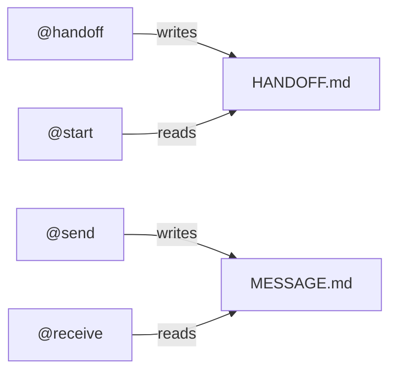

# User Commands

User commands are the primary workflow actions a user can issue.
Commands may change workflow state, activate profiles, transfer work,
or perform stateless operations.
All commands are saved prompts stored in `.amazonq/prompts/`.

> [!IMPORTANT]
> Prompts are saved in `.amazonq/prompts/` inside the repository,
> for version control, and portability. In Order to actually *use* the commands,
> they will need to be installed to the users Amazon Q prompts directory
> `~/.aws/amazonq/prompts`.
> See the [Installation Guide](../README.md#-installation) for more information.

Commands fall into five groups.

---

## 1. Transfer Commands

Commands that move work between profiles by generating a workflow file.

### `@handoff`

Create a linear workflow [handoff](glossary.md#handoff) for the next profile in the [main thread](glossary.md#main-thread)

* Produces `HANDOFF.md` content
* Current profile summarizes work and requests confirmation
* User reviews and approves
* `HANDOFF.md` created (or updated)
* Next profile is activated via `@start`

Used for: linear progression (Architect → PE → Builder → Enforcer → Documentor)

### `@send`

Create a [side trip](glossary.md#side-trip) message for parallel work.

* Produces `MESSAGE.md`
* Current profile summarizes work and requests confirmation
* User reviews and approves
* Next profile activated *in a side trip tab* via `@receive`
* Target profile performs isolated work
* User can return to main thread

Used for: parallel expertise, non‑blocking work, isolated tasks.

---

## 2. Activation Commands

Commands that activate a profile by loading a workflow file.

### `@as`

Activate a profile directly by name.
The canonical profile activation mechanism.

* Syntax: `@as [Profile] [optional task]`
* Loads profile rules via explicit rule loading
* Activates profile and begins task (if provided)
* Used internally by `@start` and `@receive`

Used for: direct profile activation, ad-hoc tasks, starting new work.

### `@start`

Activate a profile from a **handoff**, and performs the requested action.

* Loads `HANDOFF.md`
* Continues a workflow

### `@receive`

Activate a profile from a **message**, and performs the requested action.

* Loads `MESSAGE.md`
* Continues or begins a side trip workflow

### Command Symmetry

| Changeover Type | Linear (Handoff) | Parallel (Message) |
|-----------------|------------------|--------------------|
| **Change**      | @handoff         | @send              |
| **Begin**       | @start           | @receive           |



---

## 3. Save / Restore Commands

Commands that manage full workflow context.

### `@suspend`

Save workflow context, in a full context capsule.

* Writes `.amazonq/suspended/[name].md`
* Updates `INDEX.md`
* Replaces auto‑suspend for current workflowId

### `@resume`

Load workflow context, from an `@suspend`, or auto-suspend file.

* Lists contexts if no name provided
* Loads `.amazonq/suspended/[name].md`
* Restores profile and state

### `@list`

Show all suspended contexts.

* Reads `INDEX.md`
* Displays manual, auto, and completed contexts

---

## 4. Stateless Commands

Commands work across the entire workflow, regardless of the current state

### `@note`

Append a user observation to `workflow.log`.

* Logs an event in a JSONL format
* Captures human insight for later retrospective analysis

### `@inquiry`

Inquiry Mode lets you ask questions safely without triggering workflow commands
or actions.

**Purpose:**
* Ask clarifying questions about workflow state
* Explore ideas without committing to actions
* Understand context without triggering next steps
* Think through decisions before proceeding

#### Usage

`@inquiry [question]`

**Examples:**
```text
@inquiry What files were modified in the last workflow?
@inquiry Should I suspend here or continue?
@inquiry What would happen if I handoff to Architect?
@inquiry Why did Builder use a helper function?
```

#### Exit Inquiry Mode

Start a new message without `@inquiry`.

#### When to Use

**Use inquiry mode when:**
* Uncertain about next step
* Need to understand current state
* Want to explore options
* Thinking through decisions

**Don't use inquiry mode when:**
* Ready to take action
* Want to trigger workflow commands
* Need to create workflow artifacts

---

## 5. Convenience Commands

Saved prompts that provide UX shortcuts.  

### `@dr`

Start Doctor to troubleshoot a test.

### `@epr`

Enforcer evaluates a prompt and response.

### `@send-epr`

Combine `@send` + `@epr` into a single side trip evaluation.

---

## 6. Relationship to Other Documents

* [**Contract**][contract] defines guarantees and invariants for command handling.
* [**Workflow Mechanics**][mechanics] describe how handoffs, messages, and activation work.
* [**Workflow Patterns**][patterns] describe execution shapes (Straight-Forward Build, TDD, Multi‑Story, Retrospective).
* [**Rules & Governance**][governance] define interpretation, overrides, and constraints.

This document defines the commands themselves.

[contract]: dev/contract.md
[mechanics]: ../.workflow/rules/workflow/workflow-mechanics.md
[patterns]: dev/workflow-patterns.md
[governance]: dev/governance.md
